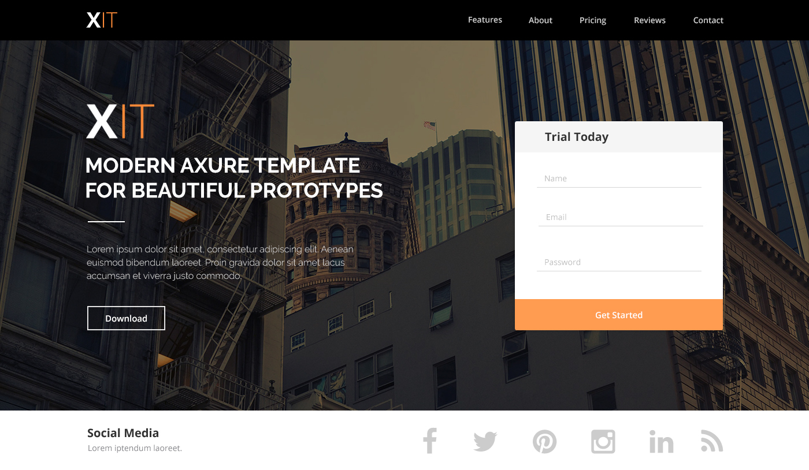

# Syntra examen
## HTML en CSS

The HTML and CSS exam on April 3, 2021 consisted of the assignment to make a pixel-perfect reproduction of the below design and to find nice responsive solutions for tablet and mobile. We were given five hours to do this.

***Design:***

***Deployment via surge:***

[http://syntra-examenhtmlencss.surge.sh/](http://syntra-examenhtmlencss.surge.sh/)

***Deployment via Vercel:***

[https://syntra-examenhtmlencss.vercel.app/](https://syntra-examenhtmlencss.vercel.app/)

